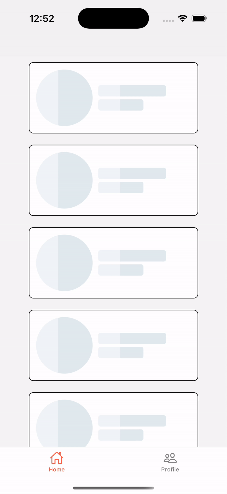

## 🎬 Demo




# 🦴 rn-skeleton-loading  

A **lightweight, customizable, and fast** skeleton loading component for React Native.  
🔥 Supports shimmer animation & fully customizable UI elements.


---

## 🚀 Installation  
You can install it using **npm** or **yarn**:

```sh
npm install rn-skeleton-loading
```

or

```sh
yarn add rn-skeleton-loading
```

---

## 🔥 Usage  
Here is a **basic usage example**:

```jsx
import { Skeleton } from "rn-skeleton-loading";
import { View } from "react-native";

export default function App() {
  return (
    <View style={{ padding: 20 }}>
      <Skeleton width="90%" height={20} />
      <Skeleton width="80%" height={20} />
      <Skeleton width={60} height={60} borderRadius={30} />
    </View>
  );
}
```

---

## 🎨 Customization  
You can **customize** the skeleton UI by passing props.

| Prop           | Type     | Default  | Description |
|---------------|----------|----------|-------------|
| `width`       | `string` / `number` | `"100%"` | Width of the skeleton |
| `height`      | `number` | `20` | Height of the skeleton |
| `borderRadius`| `number` | `4` | Border radius |
| `color`       | `string` | `"#E0E0E0"` | Base color of the skeleton |
| `highlightColor` | `string` | `"#F5F5F5"` | Shimmer effect color |
| `duration`    | `number` | `1000` | Duration of shimmer animation in ms |

### **🌟 Advanced Example (With Custom Props)**
```jsx
import { Skeleton } from "rn-skeleton-loading";
import { View } from "react-native";

export default function ProfileSkeleton() {
  return (
    <View style={{ padding: 20 }}>
      <Skeleton width={100} height={100} borderRadius={50} color="#ccc" />
      <Skeleton width="80%" height={15} style={{ marginTop: 10 }} />
      <Skeleton width="60%" height={15} style={{ marginTop: 5 }} />
    </View>
  );
}
```

---

## ✅ Features
✔ **Lightweight & Fast**  
✔ **Customizable Width, Height, Colors, Border Radius**  
✔ **Works on both iOS & Android**  
✔ **Supports shimmer animation**  
✔ **Perfect for loading states in lists, cards, and avatars**  

---

## 🤝 Contributing  
Pull requests are welcome! If you find a bug or have a feature request, **please open an issue**. 🚀  

---

## 📜 License  
**MIT License** – You are free to use, modify, and distribute this package!  

---

🎉 💡 Happy Coding 🚀😊 😎

